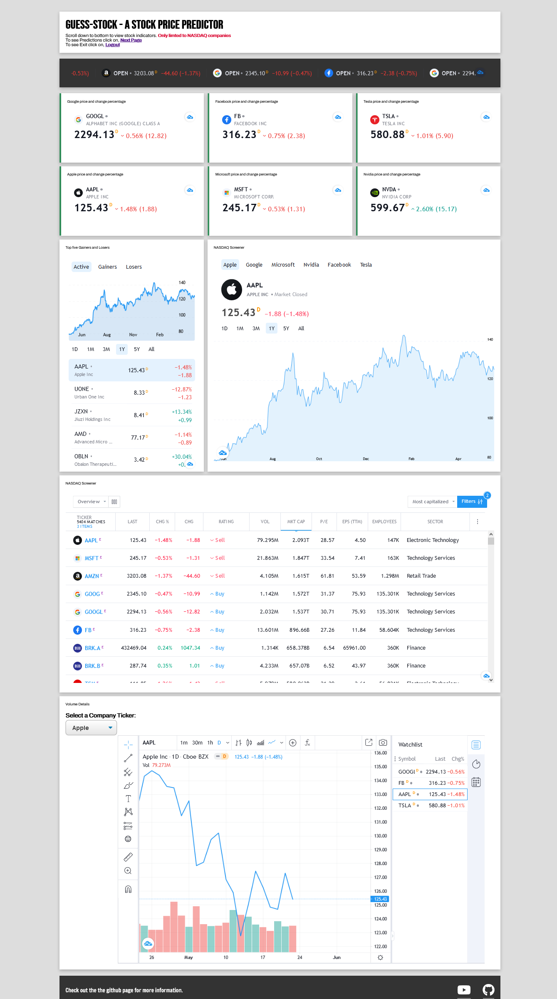
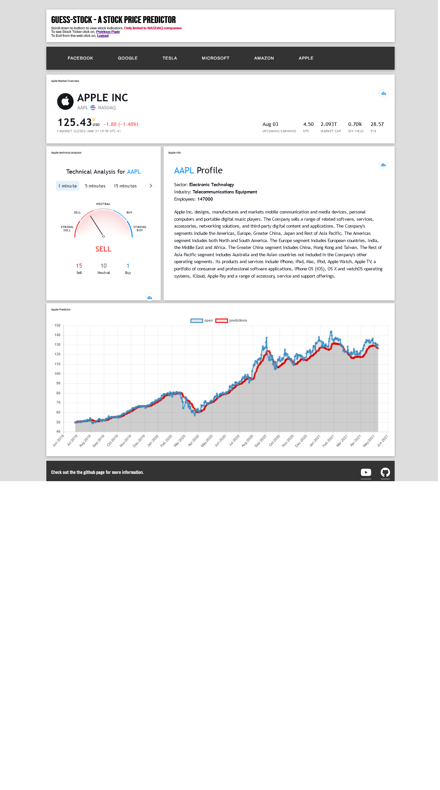

# NSU-CSE299-Stock-Price-Predictor
# `Project Title: Stock market predictor`

# Abstract: 
Stock market prediction is the act of trying to determine the future value of a company stock traded on an exchange. The successful prediction of a stock’s future price could yield significant profit. There are a lot of complicated financial indicators and the fluctuation of the stock market is very violent. Stock market predictor will help to make a better prediction based on the analysis of provided datasets and reports. 
Approach: Using Recurrence Neural Networking architecture’s LSTM (long short time memory) approach we will train the AI to analyze the datasets of a particular stock market. Our objective is to predict at least 2 months price movements of a stock using the data provided by an organization’s reports. 

# Project objective: 
1.	To accurately predict future price movements of stocks.
2.	Implement the program through web
3.	Improving the program can produce an AI trading bot to dominate the hedge fund industry.

## Group Members

| Name             | ID            | Email  |
| -------------    |:-------------:| -----:|
| Sayed Abu Noman Siddik  | 1811655042 | sayed.siddik@northsouth.edu |
| Anik Kumar Majumdar| 1811954042    | Kumar.majumder@northsouth.edu |
| Koushik Sutradhar Joy | 1620179042    |   Koushik.sutradhar@northsouth.edu |

## Web-App Front-End

